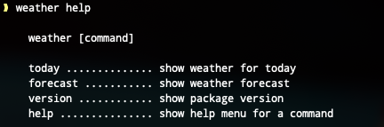
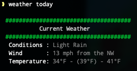
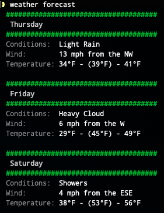

# weather-cli

This is a simple tool that gives you the ability to retrieve current and forecast weather conditions while working within a terminal or shell.

Admittedly, this tool is not really that useful, but I made it anyway in the purpose of knowledge and expanding my skillset.

## Installation


Unfortunately, there aren't many free weather APIs available, but metaweather.com provided me with the details I needed as I live near a major city on their list.

This script can easily accommodate any other JSON based API, although you're on your won if you have to authenticate.

1. Download or clone the repo from: https://github.com/gotaloha/weather-cli

2. Open a terminal or shell console, navigate into the directory you cloned the repo into and enter the following command:

   `npm install`

3. We will need to set permissions on the `bin/weather` folder to allow the script to launch properly.

   `chmod +x bin/weather`

4. Now enter `npm link` to set up a symbolic link. This will allow us to run our CLI command from any location.

5. We now need to determine your nearest weather station metaweather.com provides data for. In the JSON results provided by following the instructions below, look for a key/value pair named: `"woeid"`.

   **Copy the 7-digit number**

### Find WOEID by Searching Keyword
Enter the following URL in a browser, replacing <QUERY> with the city name you want results for.
```
https://www.metaweather.com/api/location/search/?query=<QUERY>

ex: https://www.metaweather.com/api/location/search/?query=Minneapolis
```
if all goes well, you see your city. If you can't find your city or anything close to it, I suggest that you try another API.

### Find WOEID by Searching Latitude/Longitude
You can also try searching by latitude and longitude. Simply add your lat/long in place of <LAT> and <LON> in the following URL. You may be presented with several locations.

```
https://www.metaweather.com/api/location/search/?lattlong=<LAT>,<LON>
```
6. Open the file `utils/weather.js` and modify line 6, replacing the 7-digit number with yours.

## Run the Command

Now you can simply enter: `weather today` to see a short listing, or `weather forecast` to display a 5-day forecast.

## Available Commands

### Help

```weather help```



```weather today```



```weather forecast```


